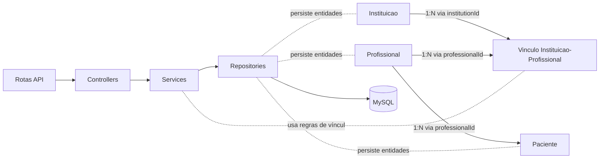

# Hospital Health API

<p align="center">
  
  
  
  
  
  
  
  
</p>

API backend para gestão hospitalar, com autenticação por token, cadastro de instituições, profissionais, pacientes e atendimntos 

## Sumário

- Visão geral
- Arquitetura
- Fluxograma de relacionamento
- Segurança
- Pré-requisitos
- Variáveis de ambiente
- Executando localmente
- Executando com Docker
- Rotas da API
- Testes automatizados

## Visão geral

- Prefixo base da API: `/api`
- Porta padrão: `3025`
- Banco de dados: `MySQL`
- Carga inicial de schema/dados via dump em `database/populated.sql`

## Arquitetura

Padrão em camadas por módulo:

- `controllers`: validação e orquestração de entrada/saída HTTP
- `services`: regras de negócio e coordenação entre repositórios
- `repositories`: acesso a dados com TypeORM
- `entities`: mapeamento objeto-relacional
- `interfaces`: contratos e DTOs

Módulos implementados:

- `auth`
- `institutions`
- `professionals`
- `institutionProfessional`
- `patients`
- `attendances`

## Fluxograma de relacionamento



## Segurança

A aplicação possui dois middlewares globais de segurança no `server.ts`:

1. Bloqueio por `User-Agent` suspeito
2. Validação de prefixo da URL com `BASE_URL`

### 1) Bloqueio por `User-Agent` suspeito

- Lê `Origin` e `User-Agent` da requisição.
- Compara o `User-Agent` com a lista de termos em `src/utils/blockedOrigins.json`.
- Se encontrar termo bloqueado, encerra a requisição com `500` e payload:

```json
{
  "message": "Acesso negado (user agent bloqueado)",
  "error": "Forbidden"
}
```

### 2) Validação de prefixo via `BASE_URL`

- Lê a URL completa da requisição por `req.originalUrl`.
- Verifica se a URL contém o valor configurado em `process.env.BASE_URL`.
- Se não contiver, bloqueia com `500` e payload:

```json
{
  "message": "Acesso negado",
  "error": "Forbidden"
}
```

## Pré-requisitos

- Node.js 18+
- Yarn 1+
- MySQL 8+

Opcional:

- Docker
- Docker Compose

## Variáveis de ambiente

Exemplo de `.env`:

```env
DB_HOST=127.0.0.1
DB_USER=dream_health_user
DB_PASSWORD=health77*
DB_NAME=dream_health
DB_PORT=3306
DB_CHARSET=utf8mb4
DB_LOGGING=true
DB_SYNCHRONIZE=true
TOKEN_SECRET=7*123cryptox
BASE_URL=/api
```

## Executando localmente

1. Instale dependências:

```bash
yarn install
```

2. Garanta que o MySQL esteja ativo com as credenciais do `.env`.

3. Inicie em modo desenvolvimento:

```bash
yarn dev
```

A API ficará disponível em:

```text
http://localhost:3025/api
```

## Executando com Docker

Suba API + MySQL:

```bash
docker compose up --build
```

A stack usa:

- API em `3025`
- MySQL em `3306`
- Import automático do dump em `database/populated.sql`

## Rotas da API

Base URL:

```text
/api
```

### Auth

- `POST /auth`

Body esperado:

```json
{
  "email": "usuario@dominio.com"
}
```

Retorno:

```json
{
  "token": "..."
}
```

### Instituições

- `POST /instituicoes`
- `GET /instituicoes`
- `GET /instituicoes/:institutionId`
- `PATCH /instituicoes/:institutionId`

### Profissionais

- `POST /profissionais`
- `GET /profissionais`
- `GET /profissionais/:professionalId`
- `PATCH /profissionais/:professionalId`

### Pacientes

- `POST /pacientes`
- `GET /pacientes`
- `GET /pacientes/:patientId`
- `PATCH /pacientes/:patientId`
- `PATCH /pacientes/status/:patientId`

### Atendimentos

- `POST /atendimentos`
- `GET /atendimentos`
- `GET /atendimentos/:attendanceId`
- `PATCH /atendimentos/:attendanceId`
- `PATCH /atendimentos/status/:attendanceId`

Observações:

- Rotas protegidas exigem header `api-key` com token JWT válido.
- `cpf` é validado nos fluxos de criação e atualização de profissional.

## Testes automatizados

Rodar todos os testes:

```bash
npx jest --no-coverage
```

Rodar por módulo:

```bash
npx jest auth.routes.test.ts --no-coverage
npx jest institution.routes.test.ts --no-coverage
npx jest professional.routes.test.ts --no-coverage
npx jest patient.routes.test.ts --no-coverage
npx jest attendance.routes.test.ts --no-coverage
```

---
